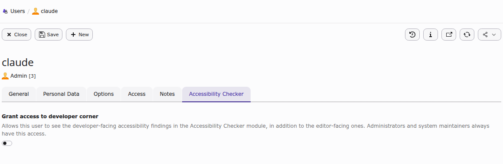
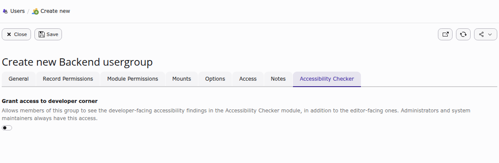

.. _configuration:

=============
Configuration
=============

This section describes the available configuration options for the Accessibility Checker.

.. _extension-configuration:

Extension Configuration
=======================

There are no global settings in the **Extension Configuration**
(**Admin Tools > Settings > Extension Configuration**). The extension works
out of the box once it is activated and the module has been made accessible to
the relevant backend users (see :ref:`installation-next-steps`).

.. _user-group-settings:

.. _configuration-developer-corner:

Developer Corner access
========================

By default, the Accessibility module only shows editor-relevant findings. The
more technical, template-facing findings, grouped under the **For developers**
tab, are hidden unless the current backend user has been explicitly granted
access to the **Developer Corner**. Administrators and system maintainers
always have this access, regardless of the setting described below.

The permission is stored on both **Backend users** and **Backend user groups**,
as a checkbox on a dedicated **Accessibility Checker** tab. It is enough to
enable it on either the user or one of its groups.

1.  Go to **Administration > Users**, then use the **Backend users** dropdown
    to switch between the *Backend users* and *Backend user groups* lists.
2.  Edit the desired user or group.
3.  Open the **Accessibility Checker** tab.
4.  Toggle **Grant access to developer corner**.

         "Grant access to developer corner" toggle and its description.
   :width: 100%

   The **Accessibility Checker** tab on a Backend user record.

         the same "Grant access to developer corner" toggle.
   :width: 100%

   The same tab on a Backend user group record. Granting access here applies
   to every member of the group.

Once saved, users with this permission see an additional **For developers** tab
in the Accessibility module the next time they open it (see
:ref:`developer-corner`).

.. _engine-selection:

Engine selection
=================

The scanning engine is chosen from the **Scanning engine** dropdown at the top
of the Accessibility module, next to the **Run Accessibility Scan** button:

*   **axe-core** (recommended and selected by default): the actively
    maintained, industry-standard engine. It produces very few false positives.
*   **HTML CodeSniffer**: an older engine with a different rule set. It can
    surface issues axe-core misses, but also produces more results that need a
    closer manual look. It is best used for a second opinion, not as the
    primary scan.

The choice only applies to the current scan; the dropdown resets to axe-core
the next time the module is opened. See :ref:`users-manual-engines` for more
detail on how the two engines differ.
