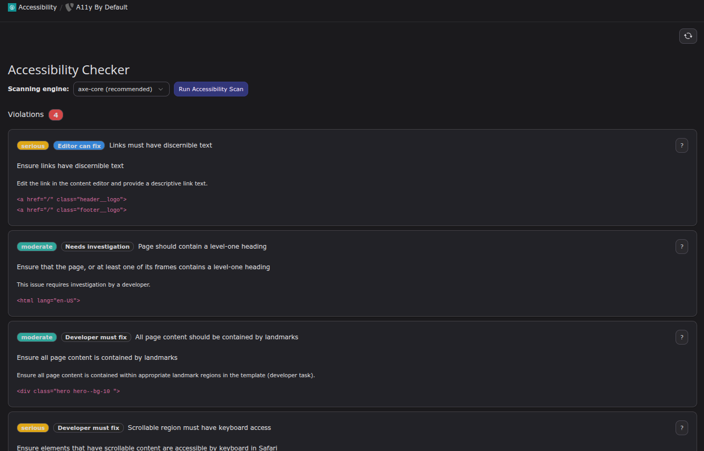
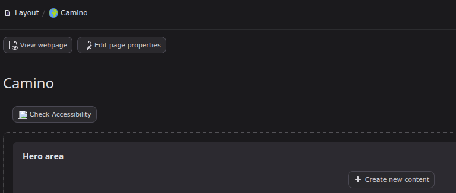

.. include:: ../Includes.rst.txt

.. _introduction:

============
Introduction
============

.. _what-it-does:

What does it do?
================

The goal of this extension is implementing a backend module showing current accessibility problems of the page selected in the page-tree.

The extension allows editors and developers to scan any page directly from the TYPO3 backend. It uses industry-standard engines like **axe-core** and **HTML CodeSniffer** to identify potential issues.

Key features include:

*   **Real-time scanning:** Issues are detected directly in the browser.
*   **Editor/Developer classification:** The module helps identify who is responsible for fixing a specific issue.
*   **Privacy & Security:** Scans are performed client-side, respecting the backend user's permissions and session.
*   **Backend Integration:** Seamlessly integrates into the TYPO3 backend with a dedicated module and Page Layout hints.
*   **Accessibility Clean:** The module itself is built with accessibility in mind, following TYPO3 styleguides and WCAG standards.

.. _quick-start:

Quick Start
===========

1.  **Install:** Use Composer (`composer require web-vision/a11y-by-default`) or the Extension Manager.
2.  **Open:** Go to the **Accessibility** module in the **Web** section.
3.  **Scan:** Select a page from the page tree. The scan starts automatically.
4.  **Fix:** Review the results and follow the links for guidance on how to fix issues.

.. _screenshots:

Screenshots
===========

   Overview of the Accessibility Checker backend module.

   Detailed view of identified accessibility issues.
