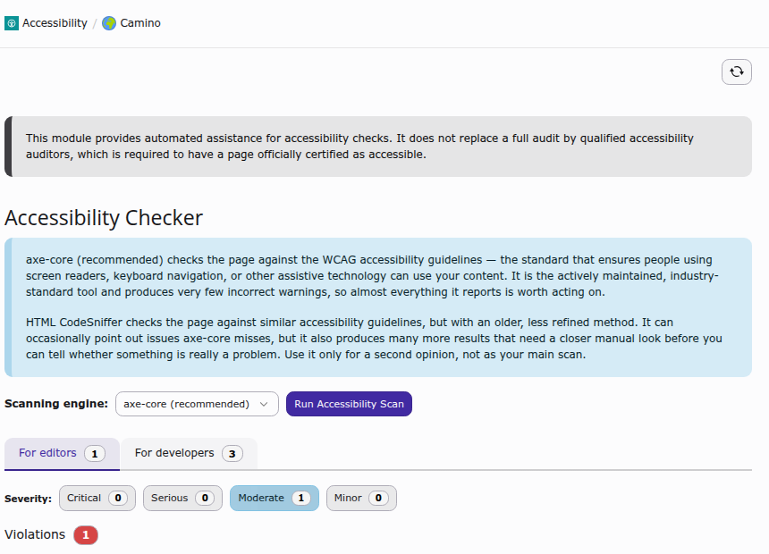

.. include:: /Includes.rst.txt

.. _introduction:

============
Introduction
============

.. _what-it-does:

What does it do?
=================

**A11y by default** adds an accessibility checker to the TYPO3 backend. It scans
the page currently selected in the page tree and shows the accessibility problems
it finds directly where editors and developers already work, without leaving the
backend or installing anything outside of TYPO3.

The scan itself happens in your browser: the extension renders the page through
TYPO3's own "View page" mechanism (the same technique used for page previews) and
then runs an accessibility testing engine against that rendered output. Because
the page is rendered through your own backend session, the scan always reflects
what a real visitor with your access rights would see, and no report data is
ever written to the database: every scan is generated fresh.

Key features
------------

*   **Two scanning engines:** `axe-core <https://github.com/dequelabs/axe-core>`__
    (recommended) and `HTML CodeSniffer <https://squizlabs.github.io/HTML_CodeSniffer/>`__
    are both bundled and can be switched per scan. See :ref:`users-manual-engines`
    for the difference between them.
*   **Editor/developer classification:** every finding is labelled as something an
    editor can fix in the content, or something that requires a template or CSS
    change. The classification is based on whether the offending markup actually
    correlates with database content (:ref:`developer-corner-classification`).
*   **Developer Corner:** the technical, template-facing findings are hidden from
    editors by default and only shown to backend users or groups that have been
    explicitly granted access (:ref:`configuration-developer-corner`).
*   **Page Layout integration:** a summary of open issues is shown as a hint
    above the *Page* module, with a direct link into the accessibility module
    (:ref:`users-manual-page-layout-hint`).
*   **No data persistence:** nothing the module finds is stored; every scan is
    generated on demand and discarded once you navigate away.
*   **Multilingual backend:** the module and its findings are translated into
    every language officially supported by the TYPO3 core.

.. _introduction-disclaimer:

What it is not
===============

A11y by default is an automated aid, not a certification. Automated tools can
only detect a subset of WCAG success criteria; issues that depend on judgement
(for example, whether alternative text is *meaningful*, not just present) still
need a human review. The module shows a disclaimer to this effect on every page
of the accessibility module. If a page needs to be certified as accessible,
that certification still has to come from a qualified accessibility audit.

.. _quick-start:

Quick start
===========

1.  **Install** the extension via Composer or the Extension Manager
    (:ref:`installation`).
2.  **Open** the **Accessibility** module in the **Web** section of the backend.
3.  **Select** a page from the page tree; the module renders it and starts the
    accessibility scan.
4.  **Review** the results, grouped by severity, and follow the fix hints shown
    for each finding.

.. _screenshots:

Screenshots
===========

         of the two available scanning engines, and the list of violations found
         on the selected page.
   :width: 100%

   The Accessibility module for a selected page, with the scanning engine
   explanation and the first violations found.

.. figure:: ../Images/pagelayout-hint.png
   :alt: A hint banner above the Page module listing the number of serious and
         moderate accessibility issues found on the page, with a button to open
         the Accessibility module.
   :width: 100%

   The Page module shows a hint whenever accessibility issues were found on the
   current page, with a direct link into the module.
