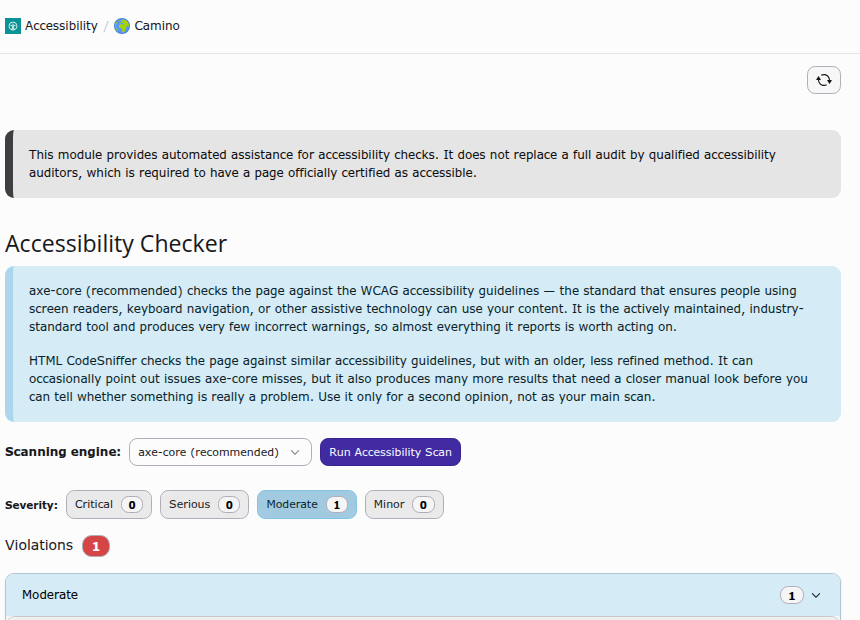
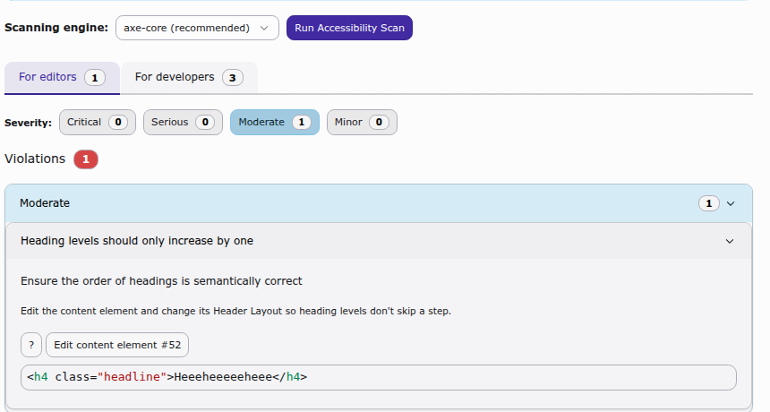
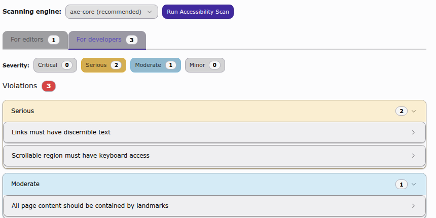
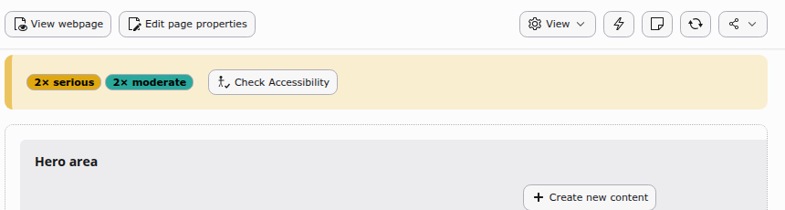

.. _users-manual:

=============
User's Manual
=============

This section describes how to use the Accessibility Checker in the TYPO3 backend.

.. _accessing-the-module:

Accessing the module
======================

Once installed and activated, you will find a new module **Accessibility** in
the **Web** section of the backend.

1.  Click on the **Accessibility** module.
2.  Select a page from the page tree on the left.

If you cannot see the module at all, ask your administrator to grant your
backend user or group access to it (:ref:`installation-next-steps`).

.. _running-a-scan:

Running a scan
===============

The scan starts automatically as soon as you select a page. The module renders
the page through TYPO3's "View page" mechanism, the same technique used for
page previews, so the result reflects exactly what you would see as a
visitor with your own access rights, inside your current backend session. You
can re-run the scan at any time with the **Run Accessibility Scan** button, for
example after switching the scanning engine.

.. _users-manual-engines:

Choosing a scanning engine
============================

Use the **Scanning engine** dropdown to pick which engine performs the scan:

*   **axe-core** (recommended, selected by default) checks the page against
    the WCAG guidelines with an actively maintained, industry-standard engine.
    It produces very few incorrect warnings, so almost everything it reports
    is worth acting on.
*   **HTML CodeSniffer** checks similar guidelines with an older, less refined
    method. It can occasionally catch issues axe-core misses, but also
    produces many more results that need a closer manual look. Use it only
    for a second opinion, not as your main scan.

.. _viewing-results:

Viewing results
=================

By default, every editor sees the same view: results grouped into four
severity levels (**Critical**, **Serious**, **Moderate** and **Minor**), with
a filter row that lets you show or hide each severity. Each severity group
can be expanded to a list of findings.

         editor-relevant findings, with no separate tab for developer
         findings.
   :width: 100%

   The default view: severity filters and the findings that apply to the
   currently logged in editor.

Below the violations, a separate **Needs review** section lists findings the
scanning engine could not automatically classify as passing or failing;
these always need a manual look.

.. _users-manual-finding-details:

Expanding a finding
=====================

Each finding can be expanded further to show:

*   a plain-language description of the problem and how to fix it,
*   who is responsible for fixing it (see :ref:`users-manual-classification`),
*   a button to jump directly to editing the affected content element, where
    the finding is linked to editable content,
*   the exact HTML markup that triggered the finding, shown in a read-only
    code viewer.

         to edit the affected content element, and the offending HTML markup
         in a read-only code viewer.
   :width: 100%

   An expanded finding, with its fix hint, an edit shortcut, and the
   offending markup.

.. _users-manual-classification:

Who is responsible for a finding
===================================

Every finding is classified as something an **editor** can fix by editing
page or content element fields, or something a **developer** has to fix in
the Fluid template or CSS. The classification looks at whether the offending
markup actually correlates with content stored in the ``pages`` or
``tt_content`` tables. See :ref:`developer-corner-classification` for the
technical details.

*   **Typically editor-fixable:** missing image alternative text
    (``image-alt``, ``input-image-alt``, ``area-alt``), non-descriptive link
    text (``link-name``), or a heading level that skips a step
    (``heading-order``), as long as the heading or link comes from a content
    element rather than the page template.
*   **Always developer-fixable:** missing page landmarks
    (``landmark-one-main``, ``region``), a missing skip-navigation link
    (``bypass``), missing or invalid ``lang`` attributes (``html-has-lang``,
    ``html-lang-valid``), insufficient color contrast (``color-contrast``),
    and similar template-level or CSS-level issues.

This classification is shown for every finding regardless of your
permissions; the optional Developer Corner, described next, only changes how
many of the developer-fixable findings you get to see.

.. _users-manual-developer-corner:

Optional: developer findings
===============================

The screenshot above is what every editor sees by default. Backend users or
groups can additionally be granted access to the **Developer Corner**
(:ref:`configuration-developer-corner`), an optional permission that reveals
the technical, template-facing findings that most editors do not need.

Once granted, the module splits its results into a **For editors** and a
**For developers** tab, each with its own severity counts.

         severity-grouped findings such as "Links must have discernible text"
         and "Scrollable region must have keyboard access".
   :width: 100%

   With Developer Corner access, an additional **For developers** tab
   appears next to the default editor findings.

See :ref:`developer-corner` for the technical background on this optional
access gate.

.. _users-manual-page-layout-hint:

Page Layout hint
==================

When working in the **Page** module, a hint banner appears above the page
content whenever accessibility issues were found on the current page. It
summarizes the number of issues per severity and links directly into the
Accessibility module for that page.

         and "2x moderate" with a "Check Accessibility" button.
   :width: 100%

   The Page module hint for a page with open accessibility findings.

.. _users-manual-limitations:

Limitations
=============

The Accessibility module provides automated assistance only; it does not
replace a full audit by qualified accessibility auditors, which is required
before a page can officially be certified as accessible. See
:ref:`introduction-disclaimer`.
